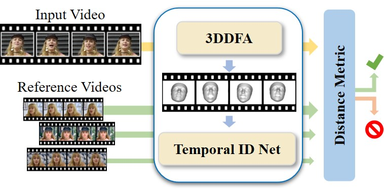
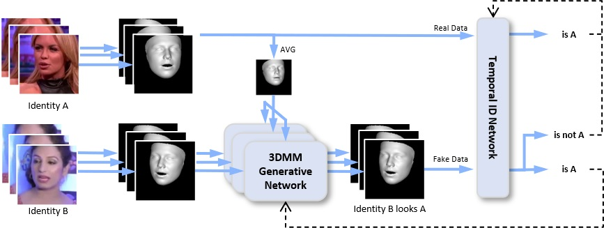

## ID-Reveal: Identity-aware Deepfake Video Detection
Davide Cozzolino, Andreas R&ouml;ssler, Justus Thies, Matthias Nie&szlig;ner, Luisa Verdoliva

  

ID-Reveal is an identity-aware DeepFake video detection. Based on reference videos of a person, we estimate a temporal embedding which is used as a distance metric to detect fake videos.  

  

ID-Reveal relies on two neural networks, the Temporal ID Network as well as the 3DMM Generative Network, which interact with each other in an adversarial fashion. Using a three-dimensional morphable model (3DMM), we process videos of different identities on a frame-by-frame basis and train the Temporal ID Network to embed the extracted features such that they can be separated in the resulting embedding space based on their containing identity. In order to incentivize this network to focus on temporal aspects rather than visual cues, we jointly train the 3DMM Generative Network to transform extracted features to fool its discriminative counterpart. 

