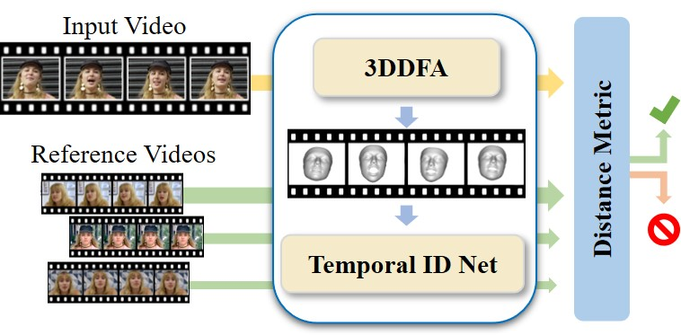

<center></center>

A major challenge in DeepFake forgery detection is that state-of-the-art algorithms are mostly trained to detect a specific fake method. As a result, these approaches show poor generalization across different types of facial manipulations, e.g., from face swapping to facial reenactment. To this end, we introduce ID-Reveal, a new approach that learns temporal facial features, specific of how a person moves while talking, by means of metric learning coupled with an adversarial training strategy. The advantage is that we do not need any training data of fakes, but only train on real videos. Moreover, we utilize high-level semantic features, which enables robustness to widespread and disruptive forms of post-processing. We perform a thorough experimental analysis on several publicly available benchmarks. Compared to state of the art, our method improves generalization and is more robust to low-quality videos, that are usually spread over social networks. In particular, we obtain an average improvement of more than 15% in terms of accuracy for facial reenactment on high compressed videos.

### News

*   2021-08-17: Paper is accepted to The International Conference on Computer Vision (ICCV) 2021.

### Bibtex

```javascript
@article{Cozzolino2020_idreveal,
  title={ID-Reveal: Identity-aware DeepFake Video Detection},
  author={Cozzolino, Davide and R{\"o}ssler, Andreas and Thies, Justus and Nie{\ss}ner, Matthias and Verdoliva, Luisa},
  journal={arXiv preprint arXiv:2012.02512},
  year={2020}
}
```
